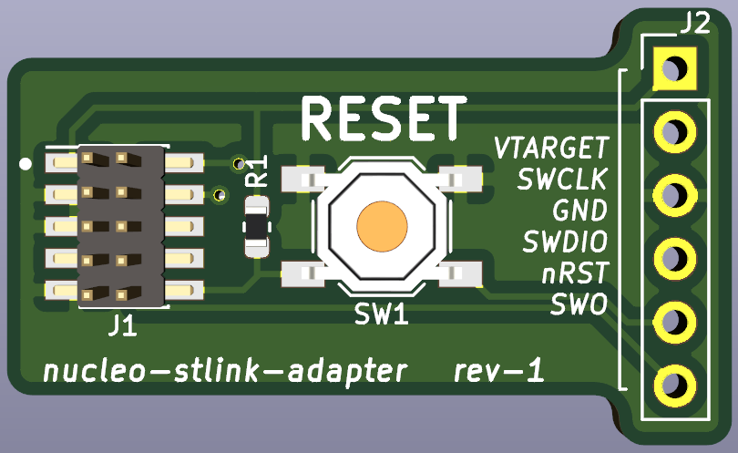

# prog-breakout

This board allows the user to break a 10pin JTAG/SWD connector out to a 6 pin header (2.54mm) for use with breadboards and is a great tool to have in your arsenal when developing projects using a JTAG/SWD interface.

A RESET push-button is provided on the board to easily reset your connected MCU core during development and the 6 pin header is also compatible with the header on ST-Link JTAG Programmers which ship with STM32 Nucleo dev-boards (STM Licenses & Agreements should be followed if this board is used in conjunction with a ST-Link and I am not responsible for any repercussions or actions taken against the user by STM)

